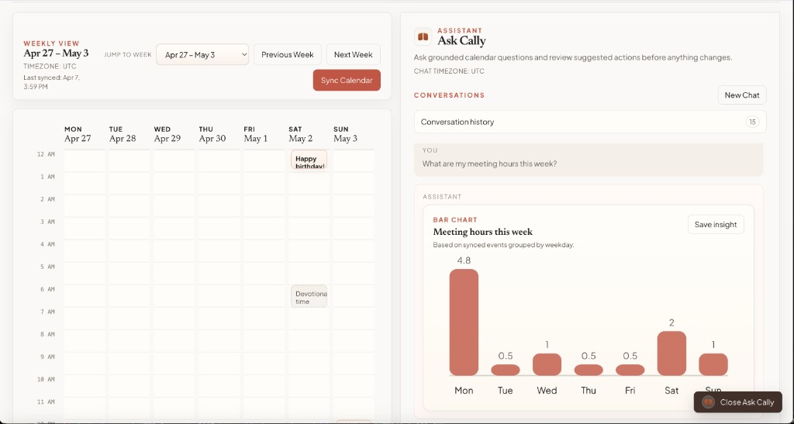
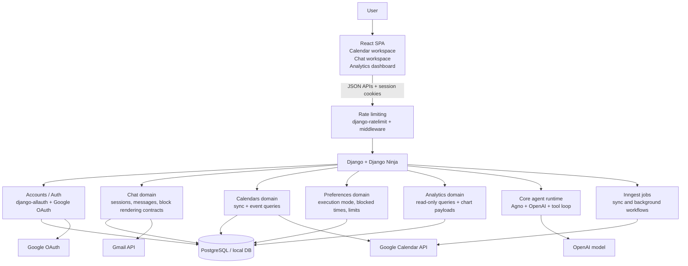
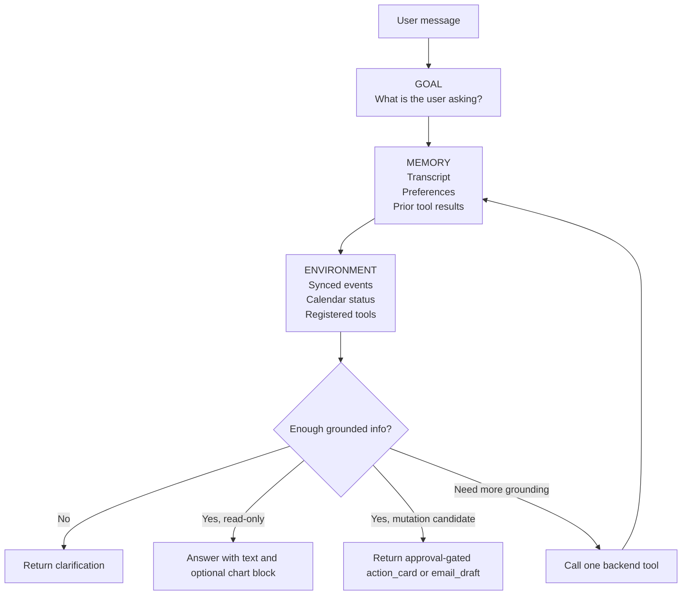

# Cally Assistant

Cally Assistant is a calendar workspace with an AI chat layer on top of synced Google Calendar data.

It lets a signed-in user:

- view their calendar in a weekly workspace
- ask schedule questions in natural language
- review approval-gated calendar actions
- draft email coordination messages
- explore read-only analytics with inline charts
- save useful analytics insights to a lightweight dashboard



## Stack

- **Frontend:** React 19, Vite 8, TypeScript, react-router-dom
- **Backend:** Django 6, Django Ninja 1.6, django-allauth (headless Google OAuth), django-ratelimit
- **Agent runtime:** Agno + OpenAI (configurable via `AGNO_MODEL_ID`, defaults to `gpt-5-mini`)
- **Background jobs:** Inngest
- **Data store:** PostgreSQL in Docker, SQLite for local backend runs
- **Quality tooling:** Black, mypy (165 source files checked), ESLint, Vitest

## How It Works

The frontend is a React SPA that talks to a Django backend over JSON APIs. The backend owns authentication, Google token storage, calendar sync, analytics queries, chat orchestration, rate limiting, and side-effect policy enforcement.

Calendar events are synced into the local database and become the source of truth for fast reads, analytics, and grounded assistant responses. The AI agent does not talk directly to Google from the browser. It runs server-side, inside a controlled loop, and can only act through registered backend tools.

## Overall System Design



## Agent Flow

The assistant follows a GAME loop (Goal, Action, Memory, Environment):

- **Goal:** interpret what the user is actually asking
- **Action:** choose the next safe step
- **Memory:** use conversation history, preferences, and prior tool outputs
- **Environment:** inspect synced calendar state and registered backend tools

The agent is backend-controlled. It cannot freely mutate state. It must either:

- answer with text
- ask a clarification
- return structured blocks like `action_card`, `email_draft`, or `chart`
- call a registered backend tool to ground the next answer



## Key Design Decisions

| Decision | Rationale |
|----------|-----------|
| **Session auth over JWT** | Calendar workspace is a single-domain SPA. HTTP-only session cookies are simpler, avoid token refresh complexity, and are harder to exfiltrate via XSS than localStorage JWTs. |
| **Synced local event store** | Querying Google Calendar on every chat turn would be slow and quota-expensive. Local sync gives fast reads, enables analytics, and decouples the agent from Google API latency. |
| **Polling over SSE for chat turns** | Simpler to implement, debug, and deploy behind any reverse proxy. SSE is a planned extension point but not needed for the current synchronous turn model. |
| **Agno as LLM orchestration layer** | Provides structured output parsing, session state management, and a clean provider abstraction without building a custom SDK integration from scratch. Also gives us the flexibility to swap in other model providers (Anthropic, Google, open-source) by changing the provider configuration rather than rewriting orchestration code. |
| **Approval-gated mutations** | Calendar changes and email sends must be explicit and reversible. The agent proposes, the user confirms. Execution mode controls how aggressive the gating is. |
| **BFF pattern** | Frontend-facing API contracts live in `bff/`, composed from internal domain services. This keeps internal domain shapes from leaking into the frontend contract. |
| **`core_agent` separated from `chat`** | The GAME loop, provider interfaces, and tool abstractions are product-agnostic. `chat` owns the conversational use case; `core_agent` is reusable infrastructure. |
| **Two-layer rate protection** | `django-ratelimit` decorators enforce per-endpoint burst limits at the HTTP layer (e.g. 5/min on chat messages, 5/min on calendar sync). The existing daily message credit system enforces business-level usage quotas at the service layer. Rate limiting fires first and blocks before any service logic runs. |

## Structured Message Blocks

Assistant responses are stored as ordered content blocks, not plain text.

| Block type | Purpose |
|------------|---------|
| `text` | Natural language response |
| `clarification` | Follow-up question to the user |
| `status` | Processing indicator (e.g. "Thinking...") |
| `action_card` | Approval-gated calendar mutation proposal |
| `email_draft` | Draft email preview with copy/block actions |
| `chart` | Bar, line, pie, or heatmap analytics visualization |

This is what allows the UI to mix natural language with structured cards and charts in one response.

## Test Coverage

The backend has **237 tests** across all 8 application domains:

- **Router tests:** authentication enforcement, cross-user access prevention, response contract validation
- **Service tests:** calendar sync workflows, preference normalization, session lifecycle, message credit limits
- **Agent tests:** GAME loop iteration, tool execution and schema validation, structured output coercion, eval snapshot verification
- **Model tests:** constraint enforcement, enum behavior, default safety checks
- **Rate limit tests:** 429 response contract, per-endpoint burst enforcement, middleware integration

Quality gates enforced via `make backend-quality`:

- **Black:** formatting (257 files)
- **mypy:** static type checking (165 source files, zero errors)
- **Django system check:** configuration validation

Frontend tests cover calendar layout math, week navigation, settings rendering, chat session switching, message parsing, email draft extraction, and blocked time utilities.

## Repository Layout

```text
backend/
  config/
  apps/
    accounts/       # user profile, auth integration, Google OAuth credentials
    analytics/      # read-only calendar analytics + saved insights
    bff/            # backend-for-frontend API contracts
    calendars/      # calendar sync, event queries, Google Calendar integration
    chat/           # sessions, messages, agent orchestration, content blocks
    core/           # shared platform: auth, types, exceptions, rate limiting
    core_agent/     # reusable agent runtime: GAME loop, providers, tools
    preferences/    # execution mode, blocked times, rate limits

frontend/
  src/
    app/            # router, layout, shell hooks, shared components
    components/     # shared UI components (UpgradeNotice)
    features/
      analytics/    # dashboard page, saved insight cards
      auth/         # login page, auth error page, auth API client
      calendar/     # weekly view, event details, sync indicator, blocked overlays
      chat/         # message list, composer, action cards, email drafts, charts
      settings/     # preferences, execution mode, blocked time management
    shared/         # utility library (cookies)

docs/
  architecture-blueprint.md
  design-theme.md
  google-oauth-setup.md
```

## Local Setup

There are two practical ways to run the app:

1. Docker for the full stack
2. Local backend/frontend processes for faster iteration

### Prerequisites

- Node 20
- Python 3.12
- Docker Desktop
- A Google Cloud OAuth client
- An OpenAI API key


### Option 1: Run With Docker

1. Copy env files:

```bash
cp backend/.env.example backend/.env
cp frontend/.env.example frontend/.env
```

2. Fill in at least these backend values in `backend/.env`:

```env
GOOGLE_CLIENT_ID=...
GOOGLE_CLIENT_SECRET=...
OPENAI_API_KEY=...
DJANGO_SECRET_KEY=change-me
POSTGRES_ENABLED=true
POSTGRES_HOST=db
POSTGRES_PORT=5432
POSTGRES_DB=tenex_cal
POSTGRES_USER=postgres
POSTGRES_PASSWORD=postgres
```

3. Start the stack:

```bash
make up
```

4. Open:

- frontend: [http://localhost:3002](http://localhost:3002)
- backend: [http://localhost:8002](http://localhost:8002)
- Inngest dev UI: [http://localhost:8388](http://localhost:8388)

Useful Docker commands:

```bash
make logs              # stream frontend + backend logs
make backend-logs      # stream backend logs only
make frontend-logs     # stream frontend logs only
make db-logs           # stream database logs
make down              # stop all containers
make restart           # rebuild and restart
make docker-shell      # shell into backend container
make docker-migrate    # run migrations inside container
make docker-test       # run backend tests inside container
```

Note: Docker Compose maps Postgres to host port `5434` to avoid conflicts with a local Postgres on `5432`. Inside the Docker network, the database is still reachable at `db:5432`.

### Option 2: Run Locally Without Docker

#### Backend

1. Activate the virtualenv:

```bash
source ~/DEVELOPMENT/virtualenv/t-cal-env/bin/activate
```

2. Install dependencies if needed:

```bash
make backend-install
```

3. Copy env:

```bash
cp backend/.env.example backend/.env
```

4. The example file includes every backend setting-backed env used in local development.
   For a SQLite-backed local run, keep:

```env
POSTGRES_ENABLED=false
```

   For Docker-backed Postgres, switch these in `backend/.env`:

```env
POSTGRES_ENABLED=true
POSTGRES_HOST=localhost
POSTGRES_PORT=5434
```

5. Run migrations and start the server:

```bash
make migrate
make runserver
```

#### Frontend

1. Use Node 20:

```bash
. ~/.nvm/nvm.sh
nvm use 20
```

2. Install dependencies:

```bash
cd frontend
npm install
```

3. Copy env:

```bash
cp .env.example .env
```

4. Start Vite:

```bash
npm run dev -- --host 0.0.0.0 --port 3002
```

## Google OAuth Setup

Detailed instructions live in [docs/google-oauth-setup.md](docs/google-oauth-setup.md).

For local development with Docker, register these:

- JavaScript origin: `http://localhost:3002`
- Redirect URI: `http://localhost:8002/accounts/google/login/callback/`

Also useful:

- `http://127.0.0.1:3002`
- `http://127.0.0.1:8002/accounts/google/login/callback/`

Important:

- the redirect URI must match exactly
- keep the trailing slash
- if your Google OAuth consent screen is in Testing mode, only listed test users can sign in

## Connect a Test Google Account

To connect a safe non-production Google account:

1. Create or use a dedicated Google test account.
2. In Google Cloud Console, open your OAuth consent screen.
3. If the app is in Testing mode, add that Gmail address under Test users.
4. Put the OAuth client credentials into `backend/.env`.
5. Start the app.
6. Open [http://localhost:3002](http://localhost:3002).
7. Click `Sign in with Google`.
8. Complete consent with the test account.
9. After login, confirm the backend can read the account and calendar state from `/api/v1/auth/me`.

Recommended scopes already configured by the backend:

- `openid`
- `email`
- `profile`
- `https://www.googleapis.com/auth/calendar.readonly`
- `https://www.googleapis.com/auth/calendar.events`
- `https://www.googleapis.com/auth/gmail.send`
- `https://www.googleapis.com/auth/gmail.compose`

## Basic Smoke Test

After signing in with a test Google account:

1. Verify the workspace loads.
2. Confirm synced events appear in the weekly calendar.
3. Ask in chat: `What does tomorrow look like?`
4. Ask in chat: `What are my meeting hours this week?`
5. Confirm a chart block renders.
6. Ask for an email draft and confirm an `email_draft` block appears.

## Running Tests

### Backend

```bash
make test              # run all 237 backend tests
make backend-quality   # format check + typecheck + Django system check
make backend-eval-test # run agent eval snapshot tests
```

### Frontend

```bash
make frontend-test
make frontend-lint
make frontend-build
```

### All Make Targets

```bash
# Backend
make backend-install       # install production dependencies
make backend-install-dev   # install dev dependencies (black, mypy, stubs)
make makemigrations        # generate new Django migrations
make migrate               # apply migrations
make runserver             # start Django dev server
make runserver-debug       # start with LOG_LEVEL=DEBUG
make check                 # Django system check
make test                  # run backend test suites
make backend-format        # auto-format with Black
make backend-format-check  # check formatting without changes
make backend-typecheck     # run mypy type checks
make backend-quality       # format-check + typecheck + system check
make backend-eval-test     # run agent eval snapshot tests

# Frontend
make frontend-test         # run Vitest tests
make frontend-lint         # run ESLint
make frontend-build        # production build

# Combined
make test-all              # backend tests + frontend tests

# Docker
make up                    # build and start all containers
make down                  # stop all containers
make restart               # rebuild and restart
make logs                  # stream frontend + backend logs
make backend-logs          # stream backend logs
make frontend-logs         # stream frontend logs
make db-logs               # stream database logs
make docker-build          # build backend + frontend images
make docker-shell          # shell into backend container
make frontend-shell        # shell into frontend container
make docker-migrate        # run migrations inside container
make docker-test           # run backend tests inside container
make createsuper           # create Django superuser inside container
```

## Design Principles

- Draft-first and approval-gated execution
- Server-side policy enforcement independent of frontend behavior
- Per-endpoint rate limiting at the HTTP layer, daily usage quotas at the service layer
- Thin routers, service-oriented backend orchestration
- Structured assistant blocks instead of opaque text
- Analytics through a constrained, allowlisted read-only query layer
- Encrypted token storage; the browser never touches Google credentials
- The agent operates through backend-registered tools and product-specific safety rules

## What I Would Build Next

- **SSE streaming** for assistant responses instead of polling, enabling token-by-token rendering
- **Real Gmail send** integration behind the existing email draft flow (the draft block is built, the send action is gated but not yet wired)
- **Multi-calendar support** (the UI scaffold exists with the Calendar Scope section, backend currently scopes to primary)
- **Webhook-driven incremental sync** to replace periodic polling (the `Calendar.webhook_*` fields and `CalendarWebhookSyncService` are in place but need a public endpoint with verified domain)
- **CI pipeline** with GitHub Actions running `make backend-quality` and `make test-all` on every push

## Further Reading
- [docs/architecture-blueprint.md](docs/architecture-blueprint.md)
- [docs/google-oauth-setup.md](docs/google-oauth-setup.md)
- [docs/design-theme.md](docs/design-theme.md)
