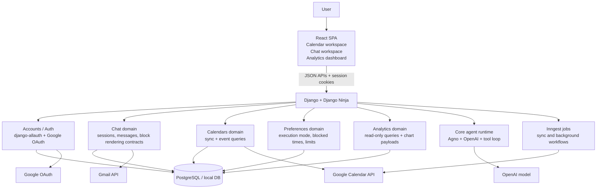
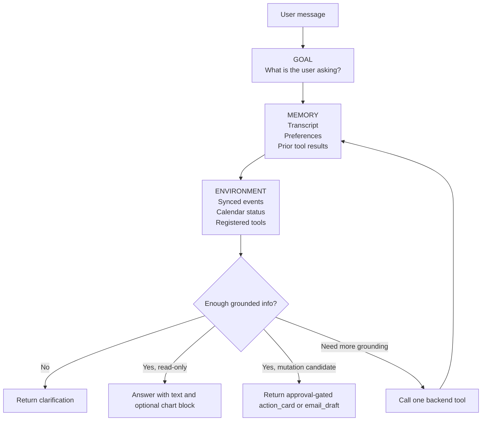

# Cally Assistant

Cally Assistant is a calendar workspace with an AI chat layer on top of synced Google Calendar data.

It lets a signed-in user:

- view their calendar in a weekly workspace
- ask schedule questions in natural language
- review approval-gated calendar actions
- draft email coordination messages
- explore read-only analytics with inline charts
- save useful analytics insights to a lightweight dashboard

The current stack is:

- frontend: React + Vite + TypeScript
- backend: Django + Django Ninja + django-allauth
- agent runtime: Agno + OpenAI
- background jobs: Inngest
- data store: PostgreSQL in Docker, SQLite or Postgres for local backend runs

## How It Works

At a high level, the frontend is a React SPA that talks to a Django backend over JSON APIs. The backend owns authentication, Google token storage, calendar sync, analytics queries, chat orchestration, and side-effect policy enforcement.

Calendar events are synced into the local database and become the source of truth for fast reads, analytics, and grounded assistant responses. The AI agent does not talk directly to Google from the browser. It runs server-side, inside a controlled loop, and can only act through registered backend tools.

## Overall System Design



## Agent Flow

The assistant follows a GAME loop:

- Goal: interpret what the user is actually asking
- Action: choose the next safe step
- Memory: use conversation history, preferences, and prior tool outputs
- Environment: inspect synced calendar state and registered backend tools

The important product constraint is that the agent is backend-controlled. It cannot freely mutate state. It must either:

- answer with text
- ask a clarification
- return structured blocks like `action_card`, `email_draft`, or `chart`
- call a registered backend tool to ground the next answer

## GAME Loop Diagram



## Feature Areas

- Calendar workspace: weekly calendar view, synced events, event details
- Chat workspace: structured assistant responses, action cards, drafts, analytics blocks
- Preferences: execution mode, blocked times, temporary blocked times
- Analytics dashboard: saved insight cards with refresh/delete

## Structured Message Blocks

Assistant responses are stored as ordered content blocks, not just plain text.

Current block types include:

- `text`
- `clarification`
- `status`
- `action_card`
- `email_draft`
- `chart`

This is what allows the UI to mix natural language with structured cards and charts in one response.

## Repository Layout

```text
backend/
  config/
  apps/
    accounts/
    analytics/
    bff/
    calendars/
    chat/
    core/
    core_agent/
    preferences/

frontend/
  src/
    features/
      analytics/
      calendar/
      chat/
      settings/

docs/
  architecture-blueprint.md
```

## Local Setup

There are two practical ways to run the app:

1. Docker for the full stack
2. local backend/frontend processes for faster iteration

### Prerequisites

- Node 20
- Python 3.12
- Docker Desktop
- a Google Cloud OAuth client
- an OpenAI API key


### Option 1: Run With Docker

1. Copy env files:

```bash
cp backend/.env.example backend/.env
cp frontend/.env.example frontend/.env
```

2. Fill in at least these backend values in `backend/.env`:

```env
GOOGLE_CLIENT_ID=...
GOOGLE_CLIENT_SECRET=...
OPENAI_API_KEY=...
DJANGO_SECRET_KEY=change-me
POSTGRES_ENABLED=true
POSTGRES_HOST=db
POSTGRES_PORT=5432
POSTGRES_DB=tenex_cal
POSTGRES_USER=postgres
POSTGRES_PASSWORD=postgres
```

3. Start the stack:

```bash
make up
```

4. Open:

- frontend: [http://localhost:3002](http://localhost:3002)
- backend: [http://localhost:8002](http://localhost:8002)
- Inngest dev UI: [http://localhost:8388](http://localhost:8388)

Useful commands:

```bash
make logs
make backend-logs
make frontend-logs
make down
```

### Option 2: Run Locally Without Docker

#### Backend

1. Activate the virtualenv:

```bash
source ~/DEVELOPMENT/virtualenv/t-cal-env/bin/activate
```

2. Install dependencies if needed:

```bash
make backend-install
```

3. Copy env:

```bash
cp backend/.env.example backend/.env
```

4. The example file includes every backend setting-backed env used in local development.
   For a SQLite-backed local run, keep:

```env
POSTGRES_ENABLED=false
```

   For Docker-backed Postgres, switch these in `backend/.env`:

```env
POSTGRES_ENABLED=true
POSTGRES_HOST=db
POSTGRES_PORT=5432
```

5. Run migrations and start the server:

```bash
make migrate
make runserver
```

#### Frontend

1. Use Node 20:

```bash
. ~/.nvm/nvm.sh
nvm use 20
```

2. Install dependencies:

```bash
cd frontend
npm install
```

3. Copy env:

```bash
cp .env.example .env
```

4. Start Vite:

```bash
npm run dev -- --host 0.0.0.0 --port 3002
```

## Google OAuth Setup

Detailed instructions live in [docs/google-oauth-setup.md](/Users/uzomaemuchay/DEVELOPMENT/tenex_co_cal_app/docs/google-oauth-setup.md).

For local development with Docker, register these:

- JavaScript origin: `http://localhost:3002`
- Redirect URI: `http://localhost:8002/accounts/google/login/callback/`

Also useful:

- `http://127.0.0.1:3002`
- `http://127.0.0.1:8002/accounts/google/login/callback/`

Important:

- the redirect URI must match exactly
- keep the trailing slash
- if your Google OAuth consent screen is in Testing mode, only listed test users can sign in

## Connect a Test Google Account

To connect a safe non-production Google account:

1. Create or use a dedicated Google test account.
2. In Google Cloud Console, open your OAuth consent screen.
3. If the app is in Testing mode, add that Gmail address under Test users.
4. Put the OAuth client credentials into `backend/.env`.
5. Start the app.
6. Open [http://localhost:3002](http://localhost:3002).
7. Click `Sign in with Google`.
8. Complete consent with the test account.
9. After login, confirm the backend can read the account and calendar state from `/api/v1/auth/me`.

Recommended scopes already configured by the backend:

- `openid`
- `email`
- `profile`
- `https://www.googleapis.com/auth/calendar.readonly`
- `https://www.googleapis.com/auth/calendar.events`
- `https://www.googleapis.com/auth/gmail.send`
- `https://www.googleapis.com/auth/gmail.compose`

## Basic Smoke Test

After signing in with a test Google account:

1. Verify the workspace loads.
2. Confirm synced events appear in the weekly calendar.
3. Ask in chat: `What does tomorrow look like?`
4. Ask in chat: `What are my meeting hours this week?`
5. Confirm a chart block renders.
6. Ask for an email draft and confirm an `email_draft` block appears.

## Running Tests

### Backend

```bash
make check
make test
```

### Frontend

```bash
make frontend-test
make frontend-lint
make frontend-build
```

### Make Targets

```bash
make backend-install
make backend-install-dev
make migrate
make runserver
make check
make test
make test-all
make frontend-test
make frontend-lint
make frontend-build
make up
make logs
make down
```

## Current Design Principles

The implementation is guided by the docs in [`docs/`](/Users/uzomaemuchay/DEVELOPMENT/tenex_co_cal_app/docs):

- draft-first and approval-gated execution
- server-side policy enforcement
- thin routers, service-oriented backend orchestration
- structured assistant blocks instead of opaque text
- analytics through a constrained read-only query layer

## Important Notes

- The browser never receives Google OAuth tokens directly.
- Calendar and Gmail actions are server-managed.
- The agent is not free-form autonomous. It operates through backend-registered tools and product-specific safety rules.
- The analytics layer is intentionally narrow and allowlisted.

## Further Reading
- [architecture-blueprint.md](/Users/uzomaemuchay/DEVELOPMENT/tenex_co_cal_app/docs/architecture-blueprint.md)
- [backend-implementation-guidelines.md](/Users/uzomaemuchay/DEVELOPMENT/tenex_co_cal_app/docs/backend-implementation-guidelines.md)
- [frontend-implementation-guidelines.md](/Users/uzomaemuchay/DEVELOPMENT/tenex_co_cal_app/docs/frontend-implementation-guidelines.md)
- [google-oauth-setup.md](/Users/uzomaemuchay/DEVELOPMENT/tenex_co_cal_app/docs/google-oauth-setup.md)
