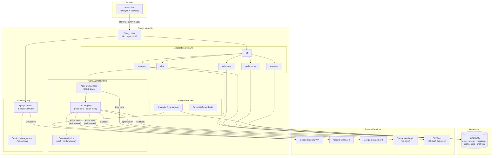

# Architecture Blueprint

**Project:** Cal Assistant
**Status:** Engineering architecture guide
**Derived from:** [product-spec.md](/Users/uzomaemuchay/DEVELOPMENT/tenex_co_cal_app/docs/product-spec.md), [frontend-implementation-guidelines.md](/Users/uzomaemuchay/DEVELOPMENT/tenex_co_cal_app/docs/frontend-implementation-guidelines.md), [backend-implementation-guidelines.md](/Users/uzomaemuchay/DEVELOPMENT/tenex_co_cal_app/docs/backend-implementation-guidelines.md)

## 1. Purpose

This document lays out the target architecture for both frontend and backend so implementation decisions remain aligned as the product grows from V1 into a production system.

It is intentionally opinionated. We want architecture that is easy to reason about, easy to test, and resilient to the complexity introduced by AI orchestration and third-party integrations.

---

## 2. System Goals

The architecture must support:

- secure Google-authenticated access
- near-real-time calendar visibility with synced local data
- conversational AI workflows with structured responses
- approval-gated side effects
- analytics over historical event data
- incremental expansion into multi-calendar and dashboard capabilities

---

## 3. High-Level Architecture

```text
React SPA
  |
  | HTTPS: JSON APIs + SSE
  v
Django + Django Ninja
  |
  +-- Auth boundary (allauth headless + session management)
  +-- BFF boundary
  +-- Calendar domain
  +-- Chat domain
  +-- Preferences domain
  +-- Analytics domain
  +-- Core agent runtime domain
  |
  +-- Background jobs
  |     +-- calendar sync
  |     +-- retries
  |     +-- deferred side-effect processing if needed
  |
  +-- External integrations
        +-- Google Calendar API
        +-- Gmail API
        +-- Google Contacts API
        +-- LLM provider via Agno
        +-- OR-Tools optimizer
  |
  v
PostgreSQL
```

---

## 4. Frontend Component Architecture

## 4.1 Frontend domains

The frontend should be built around these feature areas:

- **Auth and onboarding**
- **Calendar workspace**
- **Chat workspace**
- **Settings**
- **Shared design system**

## 4.2 Frontend composition model

```text
App Shell
  +-- Route Containers
        +-- CalendarChatPage
              +-- CalendarWorkspace
              |     +-- Toolbar
              |     +-- Grid
              |     +-- Event Layer
              |     +-- Blocked Time Layer
              |
              +-- ChatWorkspace
                    +-- Session Switcher
                    +-- Message List
                    +-- Block Renderer
                    +-- Composer
        +-- SettingsPage
        +-- OnboardingPage
```

## 4.3 Frontend state architecture

- **server state**: calendar data, sessions, settings, analytics payloads
- **workflow state**: chat execution lifecycle and approval states
- **UI state**: drawers, modals, selected events, draft inputs

This separation prevents UI state from becoming the accidental source of truth for server workflows.

---

## 5. Backend Component Architecture

## 5.1 Backend domains

```text
core
accounts
calendars
chat
preferences
analytics
core_agent
bff
```

## 5.1.1 Backend module convention

Inside each backend domain, files should map to singular components wherever practical.

Examples:

- one model per file
- one router per resource/component
- one schema file per component
- one service per use case or orchestration concern

This convention is especially important for Django Ninja code so routes, schemas, and services remain discoverable and easy to evolve without oversized module files.

## 5.2 Backend interaction model

```text
API Router
  -> Application Service
      -> Domain Policy / Validation
      -> Repository / ORM access
      -> Integration Gateway
      -> Event/Audit logging
      -> Response DTO / Stream event
```

This is the key architectural boundary: routers should not directly own orchestration logic, and integrations should not leak transport concerns into the domain.

## 5.3 App boundary map

- `core`: shared technical building blocks only. No feature ownership.
- `core_agent`: shared agent runtime only: Agno adapters, GAME abstractions, provider boundaries, base tool contracts, policy primitives, and eval helpers.
- `accounts`: identity, account profile, social account linkage, onboarding-ready bootstrap identity state.
- `calendars`: calendar/event source-of-truth inside the app and Google Calendar synchronization.
- `chat`: concrete conversational product domain: conversation persistence, structured assistant/user message history, chat-specific capability assembly, prompt/context construction, and concrete assistant turn orchestration built on `core_agent`.
- `preferences`: user behavior settings that influence agent and scheduling behavior.
- `analytics`: read-only derived insight generation over synced calendar data.
- `bff`: frontend-facing contract assembly across multiple backend domains, including the public chat API surface.

## 5.4 Dependency graph

The backend should follow this dependency shape:

```text
core
  ^
  |
core_agent
  ^
  |
accounts      calendars      preferences      analytics
      \          |                |                /
       \         |                |               /
                     chat
                      ^
                      |
                     bff
```

Interpretation:

- `core_agent` depends only on `core`
- feature domains depend downward on `core` and may use `core_agent` when they need agent infrastructure
- `chat` is the first concrete agent-powered feature domain and may compose other domain services for conversational use cases
- `bff` sits at the top and composes frontend-ready payloads and route contracts
- horizontal peer-to-peer dependencies between feature domains should be rare and deliberate

## 5.5 Dependency rules

- `core` must not import product-domain apps
- `core_agent` must not import product-domain apps
- `accounts`, `calendars`, `chat`, `preferences`, and `analytics` should not freely import one another
- when a cross-domain dependency is needed, prefer a service or query interface over model-level coupling
- `chat` may coordinate domains for conversational use cases, but it should not take ownership of their persistence models or business rules
- `core_agent` may provide reusable runtime primitives, but it should not become the owner of product-domain workflows or persistence
- `bff` may compose multiple domains, but it should not become the place where core business rules live

---

## 6. Core Runtime Flows

## 6.1 Login and bootstrap

```text
User signs in with Google
  -> allauth completes OAuth
  -> account/user linkage persisted
  -> tokens stored securely
  -> initial calendar sync queued
  -> frontend loads session + onboarding state
```

## 6.2 Calendar read flow

```text
Frontend requests calendar range
  -> calendar API validates session and range
  -> event query service reads synced events from Postgres
  -> response DTO returned
  -> frontend renders weekly/month view
```

## 6.3 Chat flow

```text
User submits message
  -> bff chat route validates/authenticates request
  -> chat domain persists user message
  -> chat assistant turn service loads transcript + domain context
  -> chat uses core_agent runtime + read tools / policies / sync freshness checks
  -> assistant message persisted as content blocks
```

For Release 3, this flow is synchronous request/response. SSE remains a later extension point rather than a requirement of the initial read-only assistant slice.

## 6.4 Approval and execution flow

```text
Agent proposes action cards
  -> frontend shows review state
  -> user approves
  -> approval API validates execution mode and policy
  -> side-effect tool runs
  -> result persisted and streamed back
```

## 6.5 Sync flow

```text
Scheduled or on-demand trigger
  -> credential refresh
  -> Google incremental sync
  -> normalize + upsert events
  -> update sync token and timestamp
  -> expose freshness to frontend
```

---

## 7. Data Ownership and Source of Truth

- **Postgres is the source of truth for app state**: users, calendars, events, sessions, messages, preferences
- **Google is the source of truth for external calendar/email reality**
- **Agno is not a source of truth**: it orchestrates reasoning but does not own persistent business data
- **Frontend is not a source of truth for policy**: execution safeguards must remain server-side

This separation is essential for consistency and operational safety.

---

## 8. Architectural Decisions for V1

## 8.1 Chosen boundaries

- **Monolith first**: use a modular Django monolith instead of premature microservices
- **SPA frontend**: React app with strong domain boundaries
- **SSE for streaming**: simpler than WebSockets for current response streaming needs
- **Synced calendar store**: analytics and fast reads depend on local event persistence
- **BFF over thin endpoints**: frontend-facing contracts should be composed in a dedicated backend-for-frontend layer rather than leaking internal domain shapes directly
- **Core agent runtime behind service layer**: keeps Agno/GAME infrastructure reusable without letting vendor-specific logic spread across feature domains
- **Concrete agent use cases live in feature domains**: for example, `chat` owns the conversational assistant behavior while reusing `core_agent`

## 8.2 Why this is the right level of architecture now

This design follows YAGNI and evolutionary architecture principles:

- enough structure for production discipline
- not so much structure that it slows early delivery
- clean seams for future extraction if scale or complexity demands it

---

## 9. Cross-Cutting Concerns

## 9.1 Security

- session-based auth
- encrypted OAuth tokens
- server-side rate limits
- audit trail for side effects
- prompt injection defenses around event content

## 9.2 Observability

- structured logs
- request correlation IDs
- sync metrics
- tool latency metrics
- stream lifecycle visibility

## 9.3 Reliability

- background job retries for sync
- graceful handling of revoked tokens
- explicit stale-data indicators
- deterministic policy gating before side effects

---

## 10. Frontend-to-Backend Contracts

The most important API contracts to keep stable and typed are:

- auth/session bootstrap payload
- calendar event DTOs
- chat message block DTOs
- SSE event schema
- action approval payloads
- settings/preferences payloads

Whenever possible, these contracts should be versioned and validated on both ends.

---

## 11. Recommended Implementation Sequence

## 11.1 Foundation phase

- project scaffolding
- auth
- domain models
- design system tokens
- shared API client patterns

## 11.2 Core product phase

- calendar sync
- calendar UI
- chat persistence
- block renderer
- chat workspace integration

## 11.3 Intelligence phase

- agent read tools
- clarification flow
- optional SSE transport
- approval cards
- execution gating
- analytics queries

## 11.4 Hardening phase

- tests
- logging and metrics
- rate limits
- retry strategies
- accessibility and responsive polish

---

## 12. Architecture Review Checklist

When we add a new feature, we should validate:

- which domain owns it
- where the source of truth lives
- whether it introduces side effects
- what policy checks apply
- how it is observed in production
- how it degrades under failure
- what contract changes it requires

If a feature does not have clear answers to these questions, the design likely needs refinement before implementation.

---

## 13. System Architecture Diagram



### How to read this diagram

- **Client → Backend:** The React SPA communicates with Django Ninja over HTTPS using JSON request/response and SSE for streamed assistant replies.
- **BFF layer:** All frontend-facing routes go through the `bff` domain, which composes responses from feature domains without exposing internal model shapes.
- **Feature domains:** Each domain (`accounts`, `calendars`, `chat`, `preferences`, `analytics`) owns its own persistence and business rules. Horizontal coupling between them is minimised.
- **Core Agent Runtime:** `chat` delegates reasoning to Agno, which drives the GAME loop (see [product-spec.md §7](product-spec.md#7-agent-design)). Tools are registered in a central registry. All side-effect tools pass through execution policy before calling external APIs.
- **Auth boundary:** django-allauth handles the Google OAuth handshake and token lifecycle. Sessions are server-managed.
- **Background jobs:** Calendar sync runs as a background worker (scheduled or on-demand), keeping the local Postgres mirror fresh without blocking API requests.
- **External services:** Google APIs are accessed via `google-api-python-client` with tokens managed by Django, not by Agno. Claude is reached through Agno's provider abstraction. OR-Tools runs in-process for schedule optimisation.
- **PostgreSQL** is the single source of truth for all application state.
